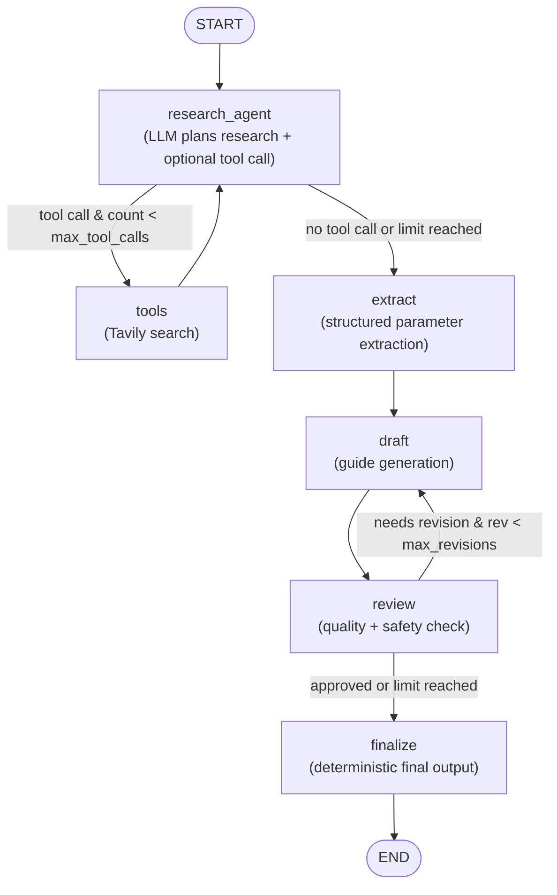
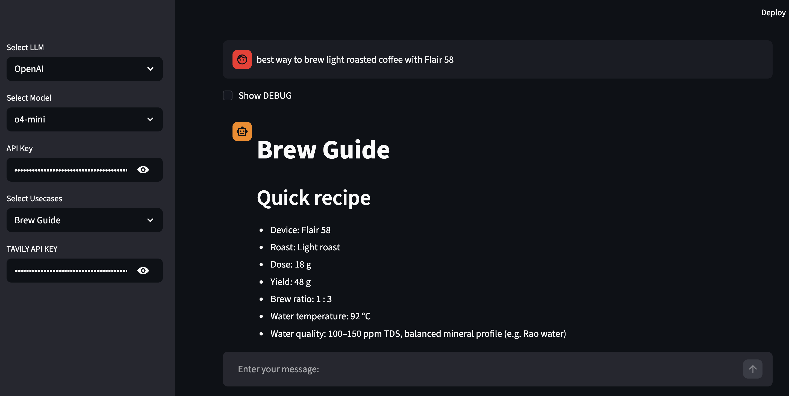
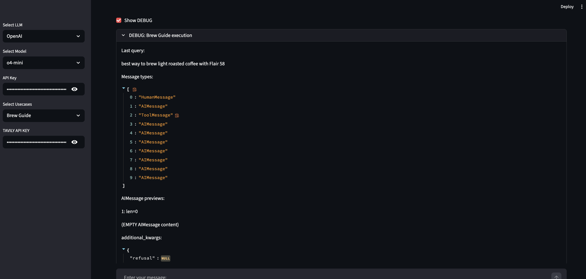

# Agentic Chatbots – LangGraph Multi-Agent System

A modular, graph-based LLM system built with **LangGraph**, demonstrating tool-augmented reasoning, state-driven routing, and multi-stage agent orchestration.

This repository is based on one of the projects from the LangGraph Udemy course and has been extended with additional capabilities and a fully original multi-stage agent.

---

## Original Udemy Project

Course reference:
https://www.udemy.com/course/complete-agentic-ai-bootcamp-with-langgraph-and-langchain

The original project provided:

### LLM Provider
- Groq (via `groqllm.py`)

### Implemented Use Cases
1. Basic Chatbot (`basic_chatbot_node.py`)
2. Chatbot with Web (`chatbot_with_Tool_node.py`)
3. AI News Summarizer (`ai_news_node.py`)

### Architecture Characteristics
- Modular node-based design
- Graph builder abstraction (`graph_builder.py`)
- Tool integration (Tavily search)
- Streamlit UI layer
- State management abstraction

The original implementation demonstrates clear separation between:

- Graph orchestration
- Node logic
- LLM provider layer
- Tool layer
- UI layer

These components remain intact in this repository.

---

## My Extensions

### 1. OpenAI Integration

Added support for OpenAI models alongside Groq:

- Provider abstraction maintained
- Compatible with existing graph architecture
- Configurable LLM selection

---

### 2. Brew Guide Agent (Fully Original Implementation)

The Brew Guide Agent is an independently designed multi-stage agent built on top of the existing graph abstraction layer.

Unlike the original single-pass chatbot use cases, this agent implements a controlled, state-driven iterative workflow with explicit loop management and quality review stages.

The implementation introduces additional graph nodes and routing logic without reusing the business logic of the original use cases.

This agent demonstrates:

- Structured research planning with tool augmentation  
- Controlled tool-calling loops  
- Dedicated parameter extraction stage  
- Iterative drafting workflow  
- Explicit self-review and revision loop  
- Deterministic state-based routing  
- Configurable loop limits (`max_tool_calls`, `max_revisions`)  

---

### 3. Debug Mode Toggle (Show Debug)

Added a UI toggle that enables a debug mode for inspecting intermediate agent behavior.

When enabled, the application displays:

- Tool call details  
- Intermediate node outputs  
- Routing decisions  
- Revision loop behavior  

This feature allows:

- Better visibility into agent execution flow  
- Easier debugging and experimentation  
- Clear separation between user-facing output and developer diagnostics  


# Brew Guide Agent – System Overview

## Example Inputs

- `Flair 58 light roast brew guide`
- `Cafelat Robot light roast feasibility`
- `How to adjust espresso shot for sour taste`
- `Aeropress inverted method medium roast`
- `How to reduce astringency in espresso`
- `Over-extracted espresso fix`

The agent supports multiple roast levels, devices, and troubleshooting-style queries.

---

## Architecture




## Design Principles (Brew Guide Agent)

### 1. Explicit Graph Orchestration

The agent is implemented using LangGraph with clearly defined nodes:

- `research_agent`
- `extract`
- `draft`
- `review`
- `finalize`

Routing is state-driven and deterministic.

---

### 2. State-Driven Conditional Routing

Router functions inspect state values:

- `tool_calls_count`
- `revision_count`
- `needs_revision`

This ensures:

- Bounded loops  
- Controlled iteration  
- Predictable execution behavior  

---

### 3. Loop Control Safeguards

Two configurable parameters control iteration limits:

```python
max_tool_calls
max_revisions
```

These prevent:
- Infinite tool loops
- Infinite revision loops
- Unbounded cost

### 4. Structured Intermediate Representation

The agent enforces a structured extraction step before drafting.

Flow:

1. Research  
2. Extract structured parameters  
3. Draft using enforced headings  
4. Review against checklist  
5. Finalize  

This reduces hallucination risk and improves output consistency.

---

## Tech Stack

- LangGraph  
- LangChain  
- OpenAI / Groq  
- Tavily Search API  
- Streamlit  

---

## Required API Keys

- OpenAI or Groq  
- Tavily  

---

## Purpose of This Repository

This repository demonstrates:

- Evolution from tutorial-based systems  
- Independent multi-stage agent design  
- Practical tool-augmented LLM workflows  
- State-based control logic  
- Production-oriented architectural thinking  

The Brew Guide Agent represents a deliberate step beyond simple chatbots toward structured, iterative AI systems.

## How to Run

1. Install dependencies
2. Prepare API keys
3. Run: streamlit run app.py

## Attribution

This repository builds upon example code from the LangGraph Udemy course referenced above.

The original course materials remain the intellectual property of their respective author.

The Brew Guide Agent and OpenAI integration are original additions created independently.

## Screenshots


### Brew Guide Output Example



### Debug Mode Enabled




## 🚀 Live Demo
[](https://agentic-chatbot-brewguide1.streamlit.app/)


